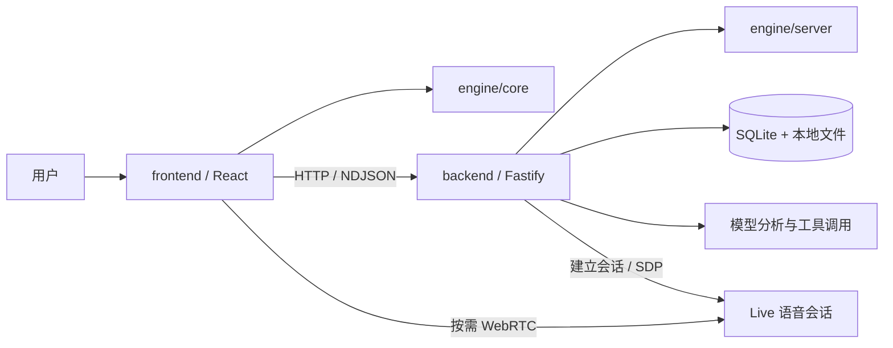
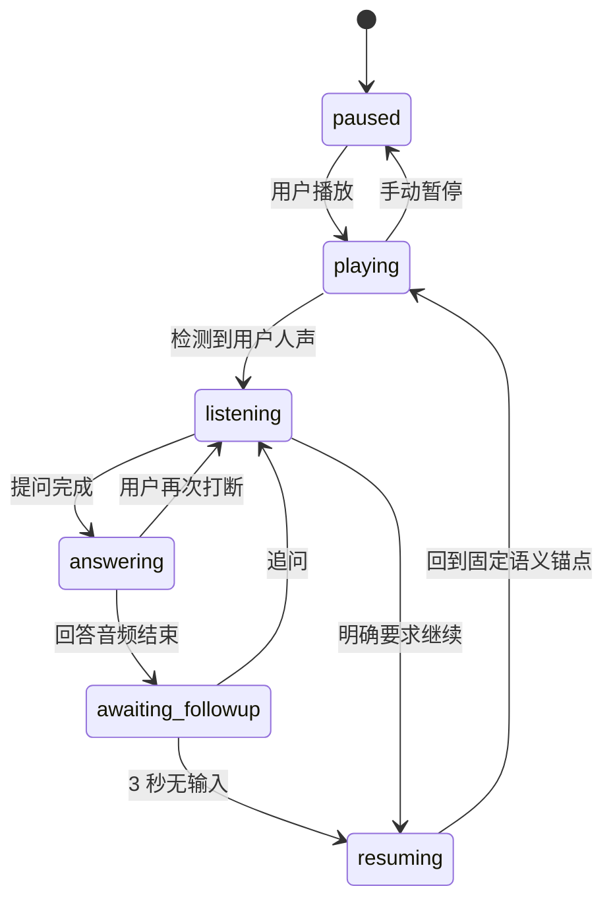

# Aside 架构说明

本文描述当前实现。历史决策见 [ADR 0001](adr/0001-interactive-podcast-architecture.md) 和 [ADR 0002](adr/0002-on-demand-live-sessions.md)；与旧设计不一致时，以当前代码及本文为准。

## 模块边界

| 模块 | 负责 | 主要入口 |
| --- | --- | --- |
| `engine/core` | 浏览器安全的类型、播放状态转换、固定续播锚点和 revision 校验 | `engine/src/core.ts` |
| `engine/server` | 分析结果组装、声音选择、上下文构造、已听内容检索 | `engine/src/server.ts` |
| `backend` | HTTP、持久化、音频处理、任务恢复、模型与工具执行 | `backend/src/app.ts`、`jobs.ts`、`provider.ts` |
| `frontend` | UI、原音频播放、本地 VAD、按需会话与实时音频 | `frontend/src/usePlayerController.ts`、`on-demand-voice.ts`、`live.ts` |

Engine 不依赖 Fastify、React、数据库或模型 SDK。前端不得导入 `engine/server` 或后端实现。`scripts/check-boundaries.mjs` 在类型检查之后检查这些导入边界。当前没有独立部署的 worker；backend 进程同时运行 API 与分析队列。

## 音频分析

1. 上传文件流写入本地存储，限制 500 MB；通过 ffprobe 验证音频并读取时长。
2. ffmpeg 根据静音位置切出约四分钟的片段，转为单声道压缩音频。
3. 各块依次进行转录和音频理解，保留词句时间戳、说话人声音倾向、语义分组、摘要和表达风格。
4. Engine 将结果组装为整期内容地图，形成 Transcript 和自然续播点。声音按说话时长汇总选择预设，未知情况使用回退规则。
5. 全部分析完成后，节目进入可互动播放状态。

转录与分析分阶段缓存，重试复用已有成功结果。服务启动时恢复被中断的分析任务。模型原始返回先落盘，再执行完整性检查、JSON 解析/修复和 schema 校验；不将截断输出当作成功结果。SDK 禁用自动重试，避免不透明地重复调用付费接口。

**尚未实现分块并行**。未来可在 Jobs 层加入有界并发，保持块 ID、缓存与合并顺序稳定，避免把并发逻辑扩散到 UI。

## 播放、打断与续播

原播客始终由浏览器音频播放器播放。点击播放同时启用本地麦克风；手动暂停关闭监听和云端会话，Agent 引起的暂停则保留监听。

图示为主要体验路径，代码还处理连接恢复、错误与取消。第一次打断时锁定恢复位置；同一轮连续追问不改写锚点。恢复时回到完整语义段落起点，并留少量音频提前量，避免从半句话继续。

回答音频结束后默认等待 3 秒，新语音、文字输入和新任务会取消计时。明确的续播指令采用保守短语匹配，命中后约 1.5 秒续播；不明确的表达由后端语义判断和 `resume_podcast` 工具处理。计时以客户端观察到的事件为准，实际还会受到语音转录和音频结束检测延迟影响。

## 麦克风与成本控制

`microphone.ts` 使用本地 Silero V5 / ONNX 检测人声，模型和 WASM 资源从本站加载。达到概率阈值、低音量底线和连续时长条件后才触发打断。`microphone-buffer.ts` 保存短暂前滚音频，避免丢掉开头。关闭 VAD 时才使用旧的纯 RMS 触发方式。

`on-demand-voice.ts` 管理两种不同生命周期：

- **本地监听**：播放期间持续存在，浏览器计算，不建立持续云端监听。
- **Live 连接**：第一次提问时创建；同一次打断的多轮对话复用，续播后保留 5 秒，空闲默认 60 秒关闭。

冷启动先收集本地提问音频，转录与建立 Live 会话并行准备。已连接时走实时音频。Live 使用麦克风流的克隆，关闭云端连接不销毁原始本地监听流。版本检查和串行关闭防止旧连接、旧回答覆盖新一轮状态。

这减少空闲云端会话时间，但不会消除首次连接延迟或实际问答费用。外放节目也是人声，VAD 不能单独保证识别其来源，仍依赖回声消除和耳机。

## Agent、上下文与工具

后端 `provider.ts` 编排问答，Live 负责实时语音交互与表达。后端最多执行五轮模型/工具循环，支持：

| 工具 | 用途 |
| --- | --- |
| `get_passage` | 读取指定节目片段 |
| `search_podcast` | 在允许的节目内容中检索 |
| `web_search` | 获取外部补充资料 |
| `resume_podcast` | 表达明确的续播意图 |

上下文包含打断位置、当前已听片段、近期内容、较早片段及对话历史。全文预分析不意味着全文直接喂给问答：默认按播放位置限制节目证据，避免提前透露后续内容。节目检索目前是关键词检索，不依赖向量数据库。

Agent 被指示以当前节目人物的第一人称视角解释，并区分不同说话人的观点；不得编造人物私生活、未表达的立场或背书。回答语言跟随最新用户提问。多人节目的输出仍只有一个预设声音。

长任务通过 NDJSON 返回工作阶段。前端等待一段时间后，按阶段触发简短语音提示，最多两次且有间隔；提示跟随用户语言。它不是检索结果。最终结果、取消和新问题会停止过期提示。

每个问题带 revision；前端取消、后端 AbortSignal 和结果校验共同防止旧回答回流。正在执行工具时不启动自动续播计时。

## 持久化与接口

默认数据目录为 `.data/`，可通过 `ASIDE_DATA_DIR` 覆盖。SQLite 使用 WAL，保存节目、播放 checkpoint 和 Live 使用记录；音频、分析分块、模型原始输出、任务状态存为本地文件。checkpoint 包含播放位置和对话历史。云端会话本身不会因持久化而永久存活。

主要 HTTP 接口均在 `/api` 下：

| 路径 | 方法 | 用途 |
| --- | --- | --- |
| `/health` | GET | 服务与公开配置 |
| `/episodes` | GET / POST | 列表与上传 |
| `/episodes/:id` | GET | 节目及分析状态 |
| `/episodes/:id/retry` | POST | 重试失败分析 |
| `/episodes/:id/audio` | GET | 支持 Range 的原音频 |
| `/episodes/:id/checkpoint` | GET / PUT | 恢复播放与历史 |
| `/episodes/:id/question` | POST | JSON 或 NDJSON 问答 |
| `/episodes/:id/transcribe-question` | POST | 冷启动提问转录 |
| `/episodes/:id/live` | POST | Live 会话协商 |
| `/episodes/:id/usage` | GET / POST | 使用时间记录 |

API Key 只在后端读取；配置通过显式白名单提供给前端。使用时间记录不是供应商账单，断线等情况可能造成统计不完整。

## 未来部署边界

当前 API 绑定 loopback，开发前端通过 Vite 代理访问，没有多用户认证。前端构建只生成静态资源，不包含生产后端启动器。

未来拆分部署时，需要补充身份认证与数据隔离、HTTPS 和代理配置、对象存储、可协调的任务队列及 worker、部署与使用量观测。保留 engine / backend / frontend 的依赖方向，可以在这些变化中复用领域逻辑与播放器。
